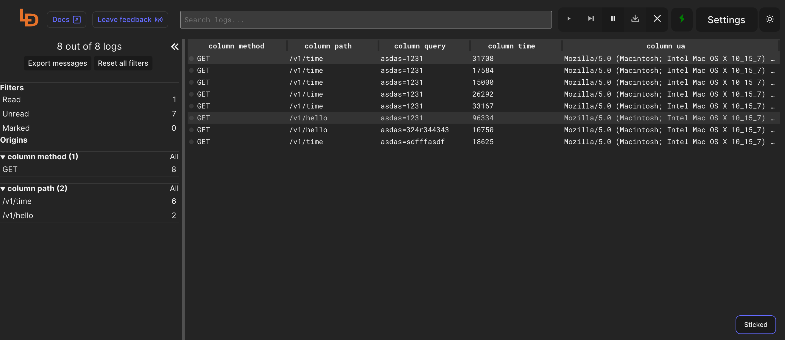

<!--
Este archivo README esta generado automaticamente<https://github.com/YunoHost/apps/tree/master/tools/readme_generator>
No se debe editar a mano.
-->

# Logdy para Yunohost

[](https://ci-apps.yunohost.org/ci/apps/logdy/)  

[](https://install-app.yunohost.org/?app=logdy)

*[Leer este README en otros idiomas.](./ALL_README.md)*

> *Este paquete le permite instalarLogdy rapidamente y simplement en un servidor YunoHost.*  
> *Si no tiene YunoHost, visita [the guide](https://yunohost.org/install) para aprender como instalarla.*

## Descripción general

Logdy is a single-binary that you add to your PATH so it's available just like any other tool: grep, awk, sed, jq. No installations, no deployments, no compilations. It works locally, so it's also secure.

**Versión actual:** 0.13.0~ynh1

**Demo:** <https://demo.logdy.dev/>

## Capturas



## Documentaciones y recursos

- Sitio web oficial: <https://logdy.dev/>
- Documentación administrador oficial: <https://logdy.dev/docs/quick-start>
- Repositorio del código fuente oficial de la aplicación : <https://github.com/logdyhq/logdy-core>
- Catálogo YunoHost: <https://apps.yunohost.org/app/logdy>
- Reportar un error: <https://github.com/YunoHost-Apps/logdy_ynh/issues>

## Información para desarrolladores

Por favor enviar sus correcciones a la [rama `testing`](https://github.com/YunoHost-Apps/logdy_ynh/tree/testing).

Para probar la rama `testing`, sigue asÍ:

```bash
sudo yunohost app install https://github.com/YunoHost-Apps/logdy_ynh/tree/testing --debug
o
sudo yunohost app upgrade logdy -u https://github.com/YunoHost-Apps/logdy_ynh/tree/testing --debug
```

**Mas informaciones sobre el empaquetado de aplicaciones:** <https://yunohost.org/packaging_apps>
