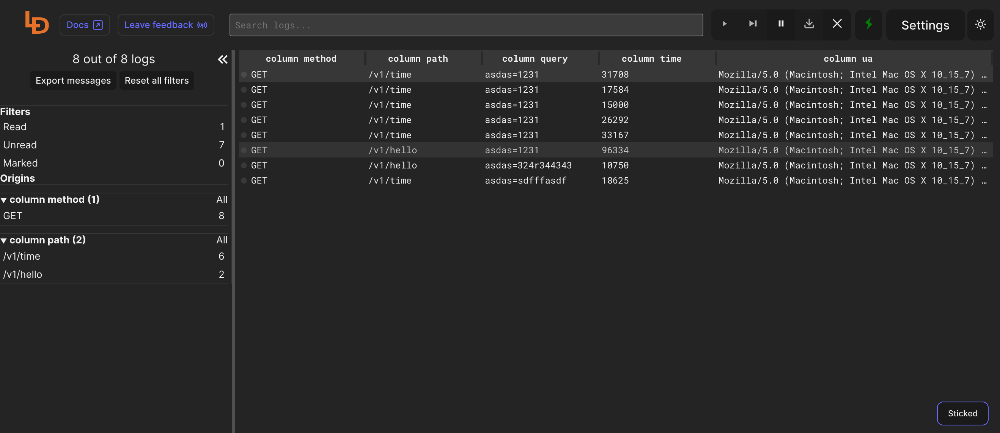

<!--
To README zostało automatycznie wygenerowane przez <https://github.com/YunoHost/apps/tree/master/tools/readme_generator>
Nie powinno być ono edytowane ręcznie.
-->

# Logdy dla YunoHost

[](https://ci-apps.yunohost.org/ci/apps/logdy/)


[](https://install-app.yunohost.org/?app=logdy)

*[Przeczytaj plik README w innym języku.](./ALL_README.md)*

> *Ta aplikacja pozwala na szybką i prostą instalację Logdy na serwerze YunoHost.*  
> *Jeżeli nie masz YunoHost zapoznaj się z [poradnikiem](https://yunohost.org/install) instalacji.*

## Przegląd

Logdy is a single-binary that you add to your PATH so it's available just like any other tool: grep, awk, sed, jq. No installations, no deployments, no compilations. It works locally, so it's also secure.

**Dostarczona wersja:** 0.13.0~ynh3

**Demo:** <https://demo.logdy.dev/>

## Zrzuty ekranu



## Dokumentacja i zasoby

- Oficjalna strona aplikacji: <https://logdy.dev/>
- Oficjalna dokumentacja dla administratora: <https://logdy.dev/docs/quick-start>
- Repozytorium z kodem źródłowym: <https://github.com/logdyhq/logdy-core>
- Sklep YunoHost: <https://apps.yunohost.org/app/logdy>
- Zgłaszanie błędów: <https://github.com/YunoHost-Apps/logdy_ynh/issues>

## Informacje od twórców

Wyślij swój pull request do [gałęzi `testing`](https://github.com/YunoHost-Apps/logdy_ynh/tree/testing).

Aby wypróbować gałąź `testing` postępuj zgodnie z instrukcjami:

```bash
sudo yunohost app install https://github.com/YunoHost-Apps/logdy_ynh/tree/testing --debug
lub
sudo yunohost app upgrade logdy -u https://github.com/YunoHost-Apps/logdy_ynh/tree/testing --debug
```

**Więcej informacji o tworzeniu paczek aplikacji:** <https://yunohost.org/packaging_apps>
