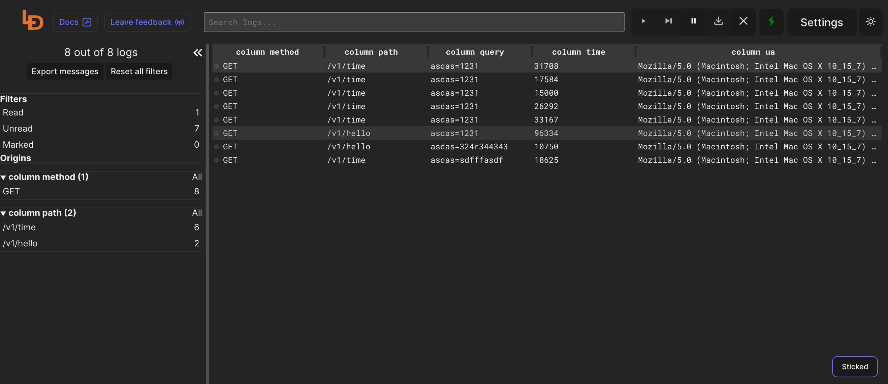

<!--
Важно: этот README был автоматически сгенерирован <https://github.com/YunoHost/apps/tree/master/tools/readme_generator>
Он НЕ ДОЛЖЕН редактироваться вручную.
-->

# Logdy для YunoHost

[](https://ci-apps.yunohost.org/ci/apps/logdy/)  

[](https://install-app.yunohost.org/?app=logdy)

*[Прочтите этот README на других языках.](./ALL_README.md)*

> *Этот пакет позволяет Вам установить Logdy быстро и просто на YunoHost-сервер.*  
> *Если у Вас нет YunoHost, пожалуйста, посмотрите [инструкцию](https://yunohost.org/install), чтобы узнать, как установить его.*

## Обзор

Logdy is a single-binary that you add to your PATH so it's available just like any other tool: grep, awk, sed, jq. No installations, no deployments, no compilations. It works locally, so it's also secure.

**Поставляемая версия:** 0.13.0~ynh2

**Демо-версия:** <https://demo.logdy.dev/>

## Снимки экрана



## Документация и ресурсы

- Официальный веб-сайт приложения: <https://logdy.dev/>
- Официальная документация администратора: <https://logdy.dev/docs/quick-start>
- Репозиторий кода главной ветки приложения: <https://github.com/logdyhq/logdy-core>
- Магазин YunoHost: <https://apps.yunohost.org/app/logdy>
- Сообщите об ошибке: <https://github.com/YunoHost-Apps/logdy_ynh/issues>

## Информация для разработчиков

Пришлите Ваш запрос на слияние в [ветку `testing`](https://github.com/YunoHost-Apps/logdy_ynh/tree/testing).

Чтобы попробовать ветку `testing`, пожалуйста, сделайте что-то вроде этого:

```bash
sudo yunohost app install https://github.com/YunoHost-Apps/logdy_ynh/tree/testing --debug
или
sudo yunohost app upgrade logdy -u https://github.com/YunoHost-Apps/logdy_ynh/tree/testing --debug
```

**Больше информации о пакетировании приложений:** <https://yunohost.org/packaging_apps>
